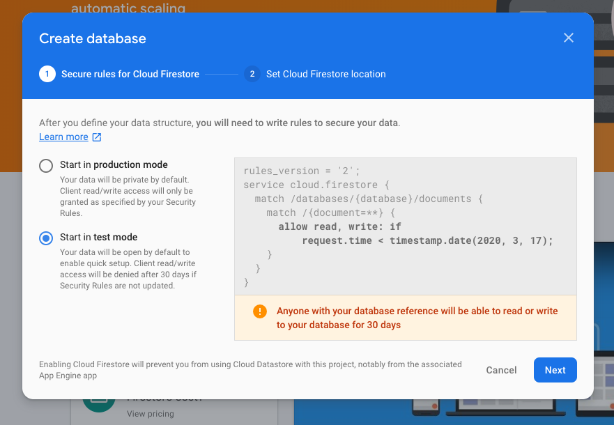

# Note App using Firebase and React Hooks

This Note Application is to explain how to use firebase with react hooks. 

## Firebase Setup

Before starting to write code, let's setup firebase first.

### Step1

Create a Project First


### Step2

Get the API key and store it somewhere


### Step 3

Create a database



## Environment Setup

To run Locally, create a file .env.development and add the following

```
AUTH_DOMAIN=
DATABASE_URL=
STORAGE_BUCKET=
APIKEY=
PROJECTID=
MESSAGE_SENDER_ID=
APP_ID=
MEASUREMENT_ID=
```

## To Run it locally

```
npm install
npm run start
```